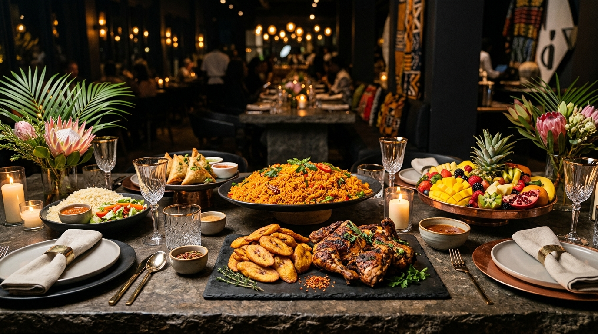
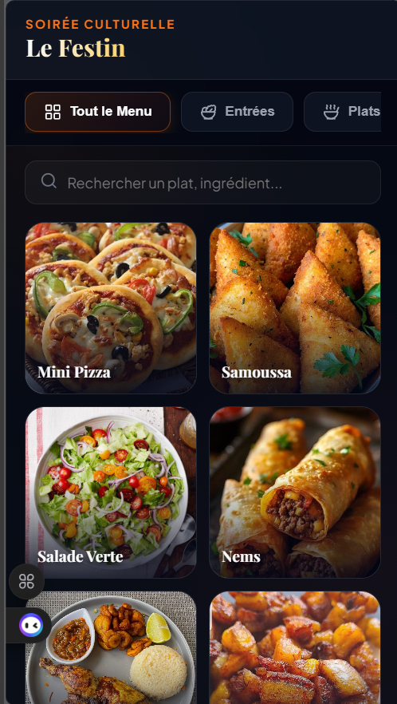
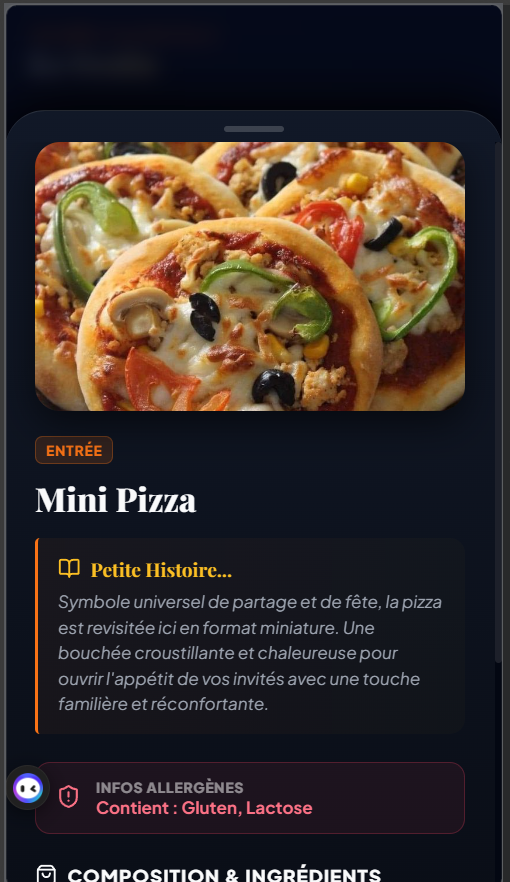

# Le Festin - Soirée Culturelle

Plateforme web interactive et mobile-first dédiée à la mise en valeur du patrimoine gastronomique interculturel.

<p align="center">
  
</p>

<p align="center">
  <a href="#"></a>
  <a href="#"></a>
  <a href="#"></a>
  <a href="#"></a>
  <a href="#"></a>
</p>

---

## Sommaire

- [Aperçu de l'Application](#aperçu-de-lapplication)
- [Présentation du Projet](#présentation-du-projet)
- [Propositions de Dénomination](#propositions-de-dénomination)
- [Fonctionnalités Principales](#fonctionnalités-principales)
- [Stack Technique](#stack-technique)
- [Installation et Prise en Main](#installation-et-prise-en-main)
- [Architecture du Code](#architecture-du-code)
- [Système de Design](#système-de-design)
- [Licence](#licence)

---

## Aperçu de l'Application

L'interface a été conçue selon une approche strictement Mobile-First, optimisée pour une consultation fluide sur smartphone lors d'événements et réceptions.

<p align="center">
  
  &nbsp; &nbsp;
  
</p>

<p align="center">
  <em>Gauche : Navigation catégorisée et grille dynamique de plats. Droite : Volet coulissant d'informations culturelles, allergènes et composition.</em>
</p>

---

## Présentation du Projet

Le Festin est une application de médiation culinaire conçue pour accompagner des buffets et réceptions multiculturelles. Contrairement à un menu statique traditionnel, la solution intègre une dimension de vulgarisation culturelle en reliant chaque mets à son histoire, ses origines géographiques et ses spécificités alimentaires.

L'objectif est d'offrir aux participants une expérience immersive, accessible instantanément depuis leur smartphone via un simple scan QR Code, sans nécessiter d'installation préalable.

---

## Propositions de Dénomination

Pour valoriser le projet dans un cadre académique, professionnel ou open source, voici plusieurs options de positionnement :

| Orientation | Nom Proposé | Description |
| :--- | :--- | :--- |
| **Identité Événementielle (Actuelle)** | **Le Festin - Soirée Culturelle** | Nom équilibré, convivial et fidèle à la vocation de rassemblement festif. |
| **Patrimoine et International** | **GourmetHeritage** | Accentue la dimension anthropologique et la transmission des traditions culinaires mondiales. |
| **Produit Digital & SaaS** | **SavorCulture** | Concision et lisibilité adaptées à un produit web ou une application de festival. |
| **Terroir et Gastronomie** | **Terroirs & Saveurs** | Met en valeur la rigueur des recettes régionales (Afrique de l'Ouest, Centrale, Québec, Europe). |

---

## Fonctionnalités Principales

### 1. Navigation et Filtrage Dynamique
- Catégorisation claire des mets : Entrées, Plats principaux, Desserts.
- Filtrage instantané côté client sans temps de latence.

### 2. Recherche Intelligente Multi-Critères
- Moteur de recherche textuel en direct.
- Indexation sur le nom du plat, les ingrédients clés (ex: manioc, arachide, plantain, poulet) et les allergènes.

### 3. Fiches de Storytelling Culturel
- Volet coulissant (Bottom Sheet) affichant le récit d'origine du plat (ex: statut UNESCO du Thiéboudienne, tradition de l'Attiéké en Côte d'Ivoire, histoire du Pâté Chinois québécois).
- Échelle graduée d'intensité d'épices.

### 4. Gestion des Allergènes et Régimes Alimentaires
- Affichage explicite des allergènes majeurs (Gluten, Lactose, Crustacés, Céleri, Œufs).
- Typologies identifiables : Végétarien, Végan, Sans Gluten, Populaire, Réconfortant.

### 5. Ergonomie et Performance
- Écran de chargement initial (Splash Screen) texturé.
- Composants légers et réactifs conçus pour un affichage instantané sur réseaux mobiles à bande passante variable.

---

## Stack Technique

| Périmètre | Outil / Bibliothèque | Rôle |
| :--- | :--- | :--- |
| **Framework UI** | React 19.2 | Gestion de l'état, architecture par composants réutilisables. |
| **Outillage de Build** | Vite 8.0 | Compilation ultra-rapide, Hot Module Replacement (HMR). |
| **Iconographie** | Lucide React | Icônes vectorielles standardisées et optimisées pour le bundle. |
| **Styles** | CSS3 Moderne (Vanilla) | Variables CSS, Glassmorphism, animations matérielles, Flexbox/Grid. |
| **Qualité de Code** | ESLint 10 | Respect des règles de syntaxe et conventions ECMAScript. |

---

## Installation et Prise en Main

### Prérequis
- Node.js (version 18.0.0 ou supérieure)
- Gestionnaire de paquets npm ou yarn

### 1. Clonage du Répertoire
```bash
git clone https://github.com/liliakeren08/SoireeCulturelle.git
cd SoireeCulturelle
```

### 2. Installation des Dépendances
```bash
npm install
```

### 3. Lancement de l'Environnement de Développement
```bash
npm run dev
```
L'application est accessible par défaut sur `http://localhost:5173`.

### 4. Compilation pour Déploiement en Production
```bash
npm run build
npm run preview
```
Les fichiers statiques optimisés sont générés dans le répertoire `dist/`.

---

## Architecture du Code

```text
SoireeCulturelle/
├── docs/
│   └── screenshots/            # Captures d'écran de référence de l'interface
│       ├── preview-menu.png
│       └── preview-details.png
├── public/                     # Ressources statiques et photographies des plats
│   ├── banner.jpg
│   ├── attiekePoulet.jpg
│   ├── Alloco.jpg
│   ├── Tchep.jpg
│   └── ...
├── src/
│   ├── components/             # Composants modulaires d'interface
│   │   ├── Header.jsx          # En-tête institutionnel
│   │   ├── CategoryTabs.jsx    # Sélecteur de sections du repas
│   │   ├── SearchBar.jsx       # Entrée de recherche interactive
│   │   ├── DishCard.jsx        # Carte de présentation condensée
│   │   └── DishBottomSheet.jsx # Panneau étendu d'informations et allergènes
│   ├── data/
│   │   └── dishes.js           # Base de données structurée des recettes et récits
│   ├── App.jsx                 # Point d'orchestration de l'état global
│   ├── index.css               # Système typographique, couleurs et tokens CSS
│   └── main.jsx                # Montage de l'arbre DOM React
├── index.html                  # Point d'entrée HTML5 et balisage SEO
├── package.json                # Déclaration des scripts et dépendances
└── vite.config.js              # Configuration du bundler Vite
```

---

## Système de Design

- **Palette chromatique** :
  - Arrière-plan principal : `#030712` (Noir graphite profond)
  - Nuances de surface : `rgba(255, 255, 255, 0.04)` avec flou d'arrière-plan (Glassmorphism)
  - Teintes d'accentuation : `#d97706` / `#fbbf24` (Or ambré)
- **Typographie** :
  - Titres et mise en valeur : Serif contemporain à fort contraste
  - Textes d'information : Famille Sans-Serif orientée lisibilité sur écran
- **Accessibilité** :
  - Respect des critères de contraste visuel recommandés
  - Zones tactiles optimisées pour l'usage à une main sur terminal mobile

---

## Licence

Ce projet est sous licence MIT. Consulter le fichier `LICENSE` pour plus de précisions.
